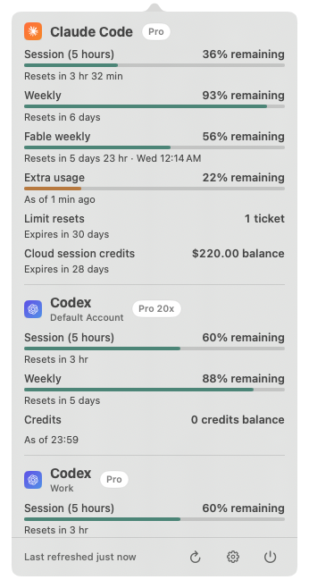
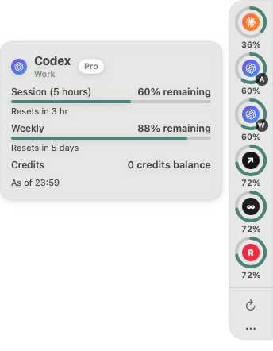
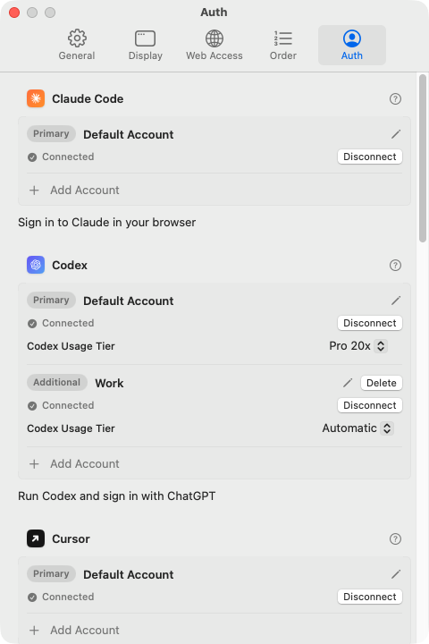
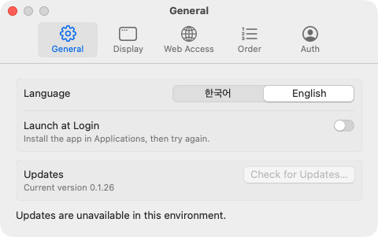
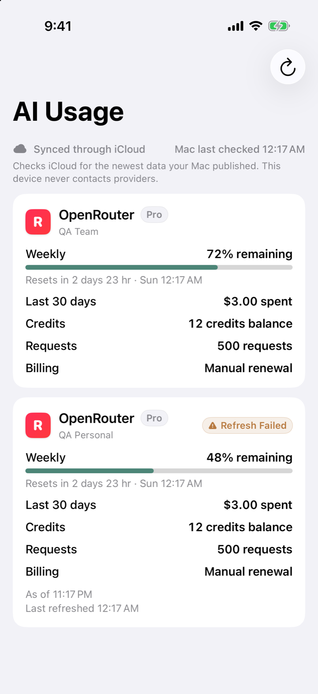
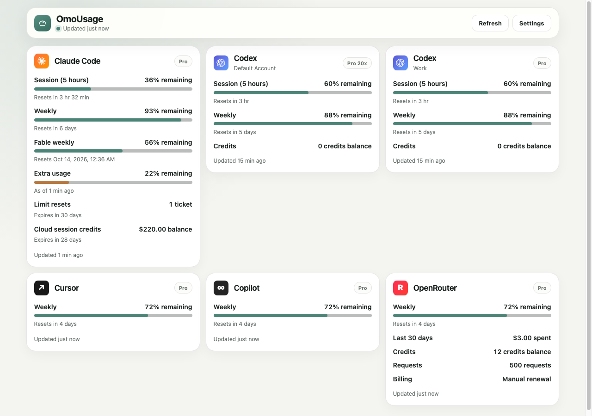

# oh-my-openusage

**See how much of every coding-AI plan you have left, right from the macOS menu bar.**

oh-my-openusage is a native macOS app that collects the remaining quota of the
coding-AI services you already pay for and shows it in one place: a menu-bar
popover, an optional edge rail, a private web page, and an iPhone companion.
It reuses the sign-ins you already have, keeps every credential on your Mac,
and runs without an account or server of its own. The app is called
**OmoUsage**.

> Inspired by [OpenUsage](https://github.com/robinebers/openusage). This is an
> independent project, not affiliated with or endorsed by OpenUsage.

<p align="center">
  <picture>
    <source media="(prefers-color-scheme: dark)" srcset="Docs/images/popover-dark.png">
    
  </picture>
</p>

<sub>Every screenshot uses the app's built-in sample data, not a real account.</sub>

## What you get

- **Menu-bar popover.** One section per account with session and weekly
  windows, credits, spend, and when each one resets. The scroll bar appears
  only while you scroll.
- **Side Notch.** An optional rail on the screen edge with a remaining-usage
  ring per account. Point at one and its details slide out beside it.
- **Native Settings.** Five panes (General, Display, Web Access, Order, Auth)
  in the standard macOS grouped style. Short panes fit their content; long
  panes scroll inside the window.
- **Several accounts per service.** Add a second Claude, Codex, or other
  account and see them side by side, each with its own name.
- **Your existing sign-ins.** Most services reuse the credential their official
  app or CLI already stored. OpenRouter and Z.ai take an API key.
- **Numbers that stay put.** Each service refreshes on its own every 60
  seconds, so one failing service never blanks the rest; the last good numbers
  stay with a clear "refresh failed" label.
- **Private web dashboard.** The same usage in a browser at
  `http://127.0.0.1:7827`, laid out for desktop and phone, and reachable from
  your own devices through Tailscale Serve.
- **iPhone companion.** A read-only app that shows the same numbers through
  your private iCloud.
- **Korean and English**, light and dark appearance, VoiceOver labels, and
  Reduce Motion support throughout.
- **In-app updates** through [Sparkle](https://sparkle-project.org).

## Screenshots

<table>
  <tr>
    <td align="center" width="50%">
      <picture>
        <source media="(prefers-color-scheme: dark)" srcset="Docs/images/side-notch-dark.png">
        
      </picture>
      <br><sub>Side Notch</sub>
    </td>
    <td align="center" width="50%">
      <picture>
        <source media="(prefers-color-scheme: dark)" srcset="Docs/images/settings-auth-dark.png">
        
      </picture>
      <br><sub>Settings › Auth</sub>
    </td>
  </tr>
  <tr>
    <td align="center" width="50%">
      <picture>
        <source media="(prefers-color-scheme: dark)" srcset="Docs/images/settings-general-dark.png">
        
      </picture>
      <br><sub>Settings › General</sub>
    </td>
    <td align="center" width="50%">
      <picture>
        <source media="(prefers-color-scheme: dark)" srcset="Docs/images/iphone-dark.png">
        
      </picture>
      <br><sub>iPhone companion</sub>
    </td>
  </tr>
  <tr>
    <td colspan="2" align="center">
      <picture>
        <source media="(prefers-color-scheme: dark)" srcset="Docs/images/web-dashboard-dark.png">
        
      </picture>
      <br><sub>Private web dashboard</sub>
    </td>
  </tr>
</table>

## Install

1. Download `OmoUsage-<version>.zip` from the
   [latest release](https://github.com/floweredao/omoUsage/releases/latest).
2. Unzip it and move `OmoUsage.app` to `/Applications`.
3. Open it. Releases are not notarized, so the first time macOS may refuse to
   open it: go to **System Settings › Privacy & Security** and choose
   **Open Anyway**.

OmoUsage lives in the menu bar, with no Dock icon. Click the gauge icon for
the popover; the gear opens Settings, where **Auth** shows every service's
connection and starts its official sign-in. **Display** switches between the
popover and the Side Notch. New versions arrive through
**Settings › General › Check for Updates**.

Requires macOS 15 or later on Apple silicon. The iPhone companion requires
iOS 18.

## Supported services

| Service | How you sign in | What OmoUsage reads |
| --- | --- | --- |
| Claude Code | `claude auth login`, or sign in with your browser from Settings | `Claude Code-credentials` Keychain item, `~/.claude/.credentials.json`, or `CLAUDE_CODE_OAUTH_TOKEN` |
| Codex | `codex login` | `~/.codex/auth.json` (honours `CODEX_HOME`) or the Codex Keychain item |
| Cursor | Cursor app › Account | Cursor's local database |
| Antigravity | Antigravity app or `agy` | `gemini` Keychain item |
| Copilot | `copilot login` or `gh auth login` | `copilot-cli` Keychain item, `~/.config/gh/hosts.yml`, or an editor's OAuth token |
| Devin | `devin auth login`, or browser sign-in from Settings | `~/.local/share/devin/credentials.toml` (honours `XDG_DATA_HOME`) |
| Grok | `grok login` | `~/.grok/auth.json` |
| Kiro | Connect from Settings (reuses an existing login or opens browser sign-in) | Account-scoped Keychain credential or Kiro CLI's `data.sqlite3` |
| OpenCode | `opencode auth login` or an API key in Settings | OpenCode's `auth.json` plus local usage records |
| OpenRouter | API key in Settings | OmoUsage's own Keychain item |
| Z.ai | API key in Settings | OmoUsage's own Keychain item |

Services you are not signed in to stay hidden. An account you add in Settings
gets its own Keychain item, so it never overwrites the official CLI's
credential.

## Privacy

- Everything runs on your Mac. OmoUsage talks only to each service's own usage
  API. There is no analytics, telemetry, or backend.
- API keys you enter are stored in the macOS Keychain and are never shown
  again, synced to iCloud, or written to diagnostics.
- The web dashboard listens on loopback only and serves the same sanitized
  snapshot as the iPhone app: totals, plan names, and reset times. It never
  sends credentials, cookies, or file paths, and every change it makes needs a
  per-launch token. To open it from another device, proxy `127.0.0.1:7827`
  with Tailscale Serve inside your tailnet; do not expose it with Tailscale
  Funnel or on a LAN interface.
- The iPhone companion never sees service credentials and never calls service
  APIs.

## Build from source

Requires the Swift 6.1 toolchain (Xcode 26) or later.

```sh
swift build                 # debug build
swift test                  # full test suite
sh Scripts/package-app.sh   # → dist/OmoUsage.app
open dist/OmoUsage.app
```

`package-app.sh` signs with the first Apple Development certificate in your
Keychain, so a rebuilt copy keeps its Keychain "Always Allow" approvals. Without
one it signs ad hoc; pass `--adhoc` to force that.

To try the app with sample data, for example to take screenshots:

```sh
OMO_USAGE_FIXTURE_MODE=1 swift run OmoUsage
```

The iPhone and Mac Catalyst companion targets live in `project.yml`
(XcodeGen) and the checked-in `OmoUsage.xcodeproj`; SwiftPM builds only the
macOS app and its tests.

## Documentation

- [`DESIGN.md`](DESIGN.md): the layout, tokens, motion, accessibility, and
  privacy rules every screen follows.
- [`RELEASE.md`](RELEASE.md): signing, Sparkle updates, and release steps.
- [`THIRD_PARTY_NOTICES.md`](THIRD_PARTY_NOTICES.md)

## Acknowledgements

- [OpenUsage](https://github.com/robinebers/openusage) for the idea and for
  showing how each service reports usage.
- [Sparkle](https://sparkle-project.org) for in-app updates.
