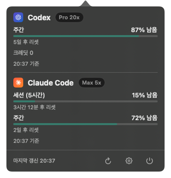

# OmoUsage

A native macOS menu-bar app that shows how much quota you have left across eleven
coding-AI providers in one popover, reusing existing logins where possible.



OmoUsage reuses credentials owned by official CLIs and apps whenever possible.
For API keys entered directly in Settings, OmoUsage owns only its exact
generic-password items in the macOS Keychain. It calls each provider's usage
endpoint and renders quota, spend, credit, count, and informational metrics.

## Supported providers

| Provider | How you sign in | What OmoUsage reads |
| --- | --- | --- |
| Claude Code | `claude auth login` | `Claude Code-credentials` keychain item, `~/.claude/.credentials.json`, or `CLAUDE_CODE_OAUTH_TOKEN`; falls back to a live Claude Desktop session |
| Codex | `codex login` | `~/.codex/auth.json` (honours `CODEX_HOME`) or the Codex keychain item |
| Cursor | Cursor app → Account | Cursor's local database |
| Antigravity | Antigravity app or `agy` | `gemini` keychain item |
| Copilot | `copilot login` or `gh auth login` | `copilot-cli` keychain item, `~/.config/gh/hosts.yml`, or an editor's OAuth token |
| Devin | `devin auth login` | `~/.local/share/devin/credentials.toml` (honours `XDG_DATA_HOME`) |
| Grok | `grok login` | `~/.grok/auth.json` |
| Kiro | Connect in Settings; reuses an existing login or opens browser sign-in | Account-scoped Keychain credential, or `~/Library/Application Support/kiro-cli/data.sqlite3` (honours absolute `KIRO_DATA_DIR`) |
| OpenCode | `opencode auth login` or API key in Settings | OpenCode's `auth.json` plus local usage records, or an OmoUsage-owned Keychain item |
| OpenRouter | API key in Settings | OmoUsage-owned Keychain item |
| Z.ai | API key in Settings | OmoUsage-owned Keychain item |

OpenRouter and Z.ai use keys entered in Settings; OpenCode can optionally use
one. Legacy OmoUsage plaintext key files migrate transactionally to Keychain
and are deleted only after registry and Keychain state converge. Everything
else can reuse an existing login. Kiro opens browser sign-in automatically
when you choose Connect without a usable existing credential.
Providers you are not signed in to are omitted.

## Requirements

Kiro first uses the selected account's saved credential or an existing CLI
login. If it is absent, expired, or rejected, Connect opens Kiro's browser
sign-in directly, without requiring the CLI or a separate import action.
The callback binds only to loopback port 3128 and validates PKCE and state.
OmoUsage validates usage before saving the credential to Keychain and renews
only its own OAuth tokens. It never rotates copied CLI tokens, substitutes a
different profile on reconnect, or opens login windows during background refresh.
Network and response errors do not trigger browser login.

Kiro's regional usage and desktop OAuth services are undocumented integration
surfaces and may change. Supported profile regions are `us-east-1` and
`eu-central-1`; the browser flow uses Kiro's hosted Google/GitHub sign-in
or continues Builder ID through AWS's browser approval flow. Builder ID's
OIDC registration secrets are kept with that account in Keychain.
Organization-specific external identity providers are not supported by
the integrated browser flow; existing supported CLI credentials still work.
When the response mixes bonus or trial credits with plan usage, OmoUsage
shows the balance as unavailable instead of inventing a remaining percentage.

- macOS 15 or later
- Swift 6.1 toolchain (Xcode 26) to build
- iOS 18 for the optional iPhone companion target

## Build and run

```sh
swift build                 # debug build
swift test                  # full test suite
sh Scripts/package-app.sh   # → dist/OmoUsage.app
```

`package-app.sh` produces a signed-for-local-use `.app`. When your keychain
holds an Apple Development certificate, it signs with that certificate, so
rebuilt installs keep their Keychain "Always Allow" grants and approval
prompts appear only once. Without one it falls back to ad-hoc signing; pass
`--adhoc` (or set `OMO_USAGE_CODESIGN_IDENTITY=-`) to force ad-hoc.
Copy it wherever you keep apps:

```sh
cp -R dist/OmoUsage.app /Applications/
open -a /Applications/OmoUsage.app
```

The app runs as a status item using the `gauge.with.dots.needle.50percent` SF
Symbol. Click it for the 320 pt popover; the gear opens Settings, where every
provider reports its connection state and can launch its official login flow.

`project.yml` (XcodeGen) and the checked-in `OmoUsage.xcodeproj` exist for the
iOS/Catalyst companion target, which SwiftPM does not build.

## How it works

Usage refreshes every 60 seconds, and each provider is fetched independently so
one failure never blanks the others. A provider that fails transiently keeps
showing its last good numbers rather than disappearing.

### Claude token refresh

Claude Code's OAuth access token lives about eight hours. When it has expired,
OmoUsage performs a `refresh_token` exchange against
`https://platform.claude.com/v1/oauth/token` and writes the rotated credential
back to the same `Claude Code-credentials` keychain item, preserving every
field the CLI owns (`scopes`, `subscriptionType`, `rateLimitTier`,
`refreshTokenExpiresAt`) so Claude Code keeps working afterwards.

Two details that are easy to get wrong:

- That token endpoint sorts clients by `User-Agent` *before* it validates the
  grant. An unrecognised agent gets `429 rate_limit_error`, which looks like
  throttling but means "unknown client".
- A failed refresh is placed under a 10 minute cooldown. Without it the
  60 second refresh loop would retry a dead token endlessly.

## iPhone companion

`OmoUsageMobile` is a read-only companion. The Mac stays the only credential
owner and publishes a usage snapshot — totals, plan labels, reset times — to
your private iCloud key-value store. Credentials, cookies, API keys, and file
paths never leave the Mac. Both targets must share a development team and team-prefixed iCloud key-value
identifier. See [`RELEASE.md`](RELEASE.md) for provisioning and trusted macOS
distribution requirements.

## Private web dashboard

While OmoUsage is running, it serves a private dashboard at
`http://127.0.0.1:7827`. The browser receives only the same sanitized usage
snapshot used by the iPhone companion. It can refresh usage, reorder providers,
hide or show providers, and choose an independent Korean or English web
language; credential setup remains native-only.

The server accepts loopback connections only. To reach it from another device,
configure Tailscale Serve to proxy `127.0.0.1:7827` inside your authenticated
tailnet. Do not expose it with Tailscale Funnel or bind it directly to a LAN or
public interface.

## Privacy

Everything runs locally. OmoUsage talks only to each provider's own API, has no
analytics or telemetry, and no backend of its own. Its web server is an
always-on loopback-only companion surface while the app is running. API keys
entered in Settings are stored in OmoUsage's exact macOS Keychain items and
are never rendered again after save, copied to iCloud, or written to
diagnostics.

## Layout

```
Sources/OmoUsage/
  Credentials/   local credential discovery per provider
  Providers/     one UsageProvider per service + response parsing
  Dashboard/     view model, refresh scheduler, provider protocol
  WebDashboard/  loopback HTTP server, commands, packaged assets
  Views/         popover, settings, meters, provider icons
  Localization/  Korean (default) and English strings
  Resources/     app icon, provider icons, web dashboard shell
  Mobile/        iOS companion
Sources/OmoUsageCore/
  Models/        shared typed usage and snapshot models
  Localization/  shared Korean/English strings and presentation
  Sync/          schema-v4 private iCloud codec and mobile state
Tests/OmoUsageTests/
Scripts/         app packaging and icon generation
Config/          Info.plist and entitlements
```

The UI ships in Korean by default; English is selectable in Settings.

## Documentation

- [`DESIGN.md`](DESIGN.md) — the design contract: visual tokens, layout,
  motion, accessibility, and the constraints the implementation must honour.
- [`RELEASE.md`](RELEASE.md) — trusted macOS signing, notarization, and iCloud
  team setup.
- [`THIRD_PARTY_NOTICES.md`](THIRD_PARTY_NOTICES.md)
